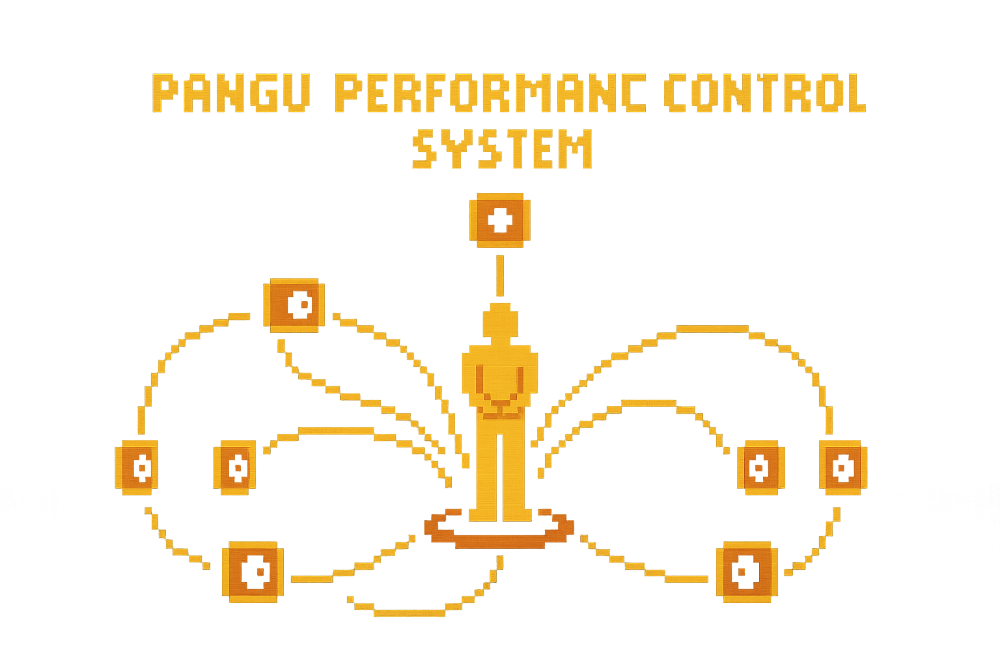

# PANGU
> PanGu is a hybrid performance operating system that uses both standard camera vision and depth cameras to turn physical movement into a three-dimensional performance space. Instead of thinking only in left/right stereo, performers compose and control sound in full 3D, mapping gestures and positions in the room to multichannel speakers and spectral processes. Designed for both live performance and experimental composition, PanGu functions as a spatial instrument and control layer, enabling artists to “play” space itself as a core musical parameter.

 [](https://github.com/CharlieSL1/PanGu-Spatial-Audio-Performance-Control-System) [](https://github.com/CharlieSL1?tab=repositories) 




## Table of Contents

- [Background](#background)
- [Tutorial] (#Tutorial)
- [Performing](#Performing Using PanGu)
- [Install](#install)
- [Version](#version)
- [TODO](#todo)
- [Contributing](#contributing)
- [citation](#citation)
- [License](#license)

## Background

As a music creator working with multichannel and spatial audio, I am interested in moving beyond the flat left–right logic of stereo toward a genuinely three-dimensional approach to performance. Instead of treating sound as a horizontal line in front of the audience, I aim to design a system in which performers think and act inside a volumetric sound field, where their position and gestures can directly shape trajectories, focus, and relationships between sound objects in space. This framework is not limited to electronic music: it can extend to theatre and musical theatre, where actors and singers become spatial sound sources, and their movement across the stage dynamically drives real-time spatialization and sound design, turning space itself into an active compositional parameter.

## Tutorial


## Performing Using PanGu


## Install

```
# Clone the repo
git clone https://github.com/CharlieSL1/PanGu-Spatial-Audio-Performance-Control-System.git

cd PanGu-Spatial-Audio-Performance-Control-System

# Create and activate a virtual environment (Python 3.12 recommended)

python3.12 -m venv .venv
source .venv/bin/activate        
# On Windows use: .venv\Scripts\activate

# Install dependencies
pip install --upgrade pip
pip install -r requirements.txt

# Start PANGU!
```

## Version
| Version | Compatible Platform |
| ----------- | ----------- |
| [V 1.0.0](V1.X.X/Ableton/README.md)| Ableton 12 User ( V12.2 or later version)|
| [V 1.0.1](V1.X.X/MAC/README.md)|MAC OS User ( Sequoia 15.6.1 or later version )|
| [V 1.0.2](V1.X.X/Windows/README.md)|Windows 11 ( 25H2 or later version) |


## TODO

- [X] Github Page Setup (Nov/22/2025) By Li Shi

- [X] Horizontal Camera module functional (Nov/25/2025) By Li Shi
    - [X] Adding both hand datapoint collection and gesture collection (Nov/25/2025) By Li Shi
    - [X] Take care of hypersensitivity action (Nov/26/2025) By Li Shi
    - [X] Motion Tracking added (Nov/26/2025) By Li Shi

- [X] Veritcal Camera module functional(Nov/26/2025) By Li Shi
    - [X] Get Depth View 

- [] M4L Plugin Ready
    - [X] Horizontal Data OSC send to Max (Nov/26/2025) By Li Shi
    - [X] Veritcal Data OSC send to Max (Nov/26/2025) By Li Shi
    - [X] Horizontal View Show
    - [X] Veritcal View Show
    - [ ] UI design 

- [] Performing System demonstration Video
- [] UI Design for all platform

## Contributing

```
Core System

Concept & Lead Design: Li (Charlie) Shi

System Design & Technical Direction: Li (Charlie) Shi

Computer Vision & Depth Sensing Engine: Li (Charlie) Shi

Multichannel & Spatial Audio Mapping: Li (Charlie) Shi

Spectral Processing & Sound Design: Li (Charlie) Shi

Prototyping & Integration: Li (Charlie) Shi

Video

Camera: Han

Video Editing: Han

Special Thanks

Akito van Troyer

```


## Acknowledgements

PanGu uses:
- [MediaPipe](https://arxiv.org/abs/1906.08172) for high-level perception pipelines.

- [OpenCV](https://opencv.org/) for low-level computer vision processing.  
  Bradski, G. (2000). *The OpenCV Library*. Dr. Dobb's Journal of Software Tools.

- [DepthAI](https://github.com/luxonis/depthai) by Luxonis for depth camera and spatial AI integration.

- [OBS Studio](https://obsproject.com/) – free and open source software for video recording and live streaming, developed by the OBS Project.:contentReference[oaicite:0]{index=0}


## License
[MIT](LICENSE) © lishi
